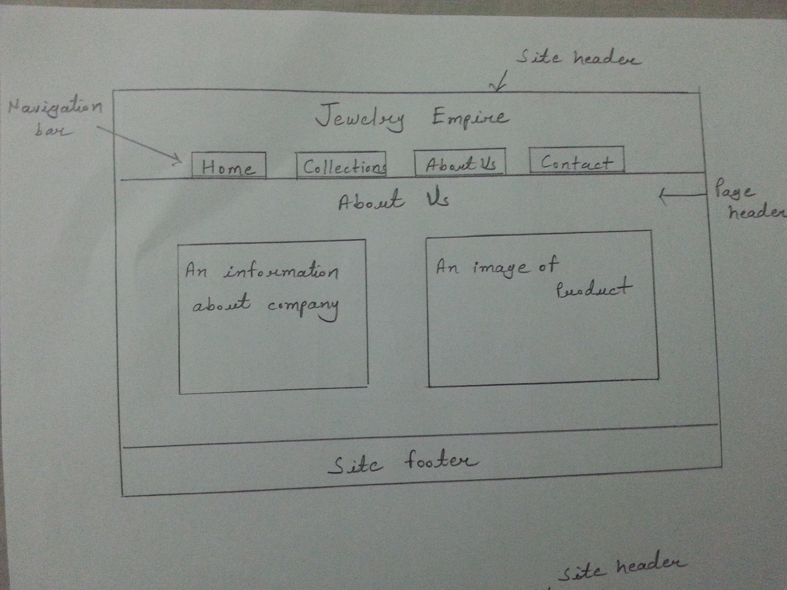

# Website Assignment 

**The website is themed on an ecommerce site selling Jewellery.**

The requirement was to create the website that I have designed as part of the CTEC3905 Front End Web Development module. The website contains four pages: Index page, Collection page, About Us page and Contact page. In the website, JavaScript was used to validate the user input. If the user did not write anything in the text boxes, a message is displayed to the user to fill the text field. This was repeated for all the fields on the contact form. Some javascript was also used to add the location marker and provide the company name using google maps API on the contacts page. CSS styles were added to the website for mobile and desktop versions. The CSS style use animation and transition to achieve some effects on the pages.

##4 Basic design principles
**1.Proximity** 
Grouping related products to for a group. On the website, related or similar products are places close to each other on the collection page where image and product details are grouped. The users can view the details and price together and make their selection.

**2.Alignment**
 Elements have been aligned on every page of the website to create an appealing layout. Alignment is important to get a consistent feel for both the Mobile and Desktop versions so that the information on the page is structured in a clear way. It makes it easier for the users to view the pages.

**3.Repetition**
 The design theme has been repeated on the pages to create a consistent look. The same size of fonts for the body and titles have been used to make the sections look similar and for the customers to read the content of the pages easily.The images have a similar background style to make the pages consistent across the site.

**4.Contrast**
 The layout of the website is simple so that the information is presented in a clear way. The main body of the website is presented in a contrasting colour to make it look visually pleasing. The navigation links as use a contrasting colour on hover to highlight possible selections on the links to go to different pages. 

## Information Architecture
**1.Potential Users**
 People who want to buy jewellery. They can be viewing the website nationally or internationally. 

**2.Content**
 Simple navigation is used to navigate between pages for the audience. For the mobile version, a hamburger drop-down list menu used to navigate pages.

**3.Context**
 The purpose of the jewellery website is to sell products online and target online customers. The website is meant to be used by people irrespective of their gender, ethnicity or computer experience. The Jewelry Empire's aim is to get as many customers as possible and make maximum profits from sales. 

## Validation of the website
**1.HTML**
**2.CSS**
**3.Accessibility** 

## Wireframes
**Hand drawn wireframes**

## References
https://www.w3schools.com/html/
W3 School website was used to reference HTML, CSS, JavaScript, Transitions, and Animations 