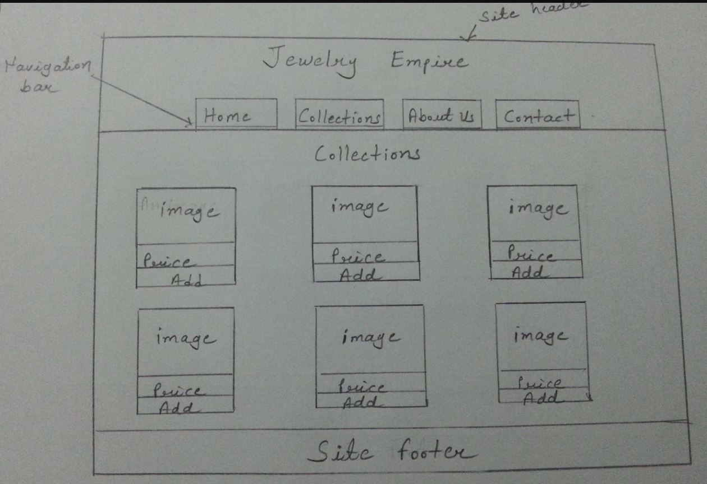

# Website Assignment 

**The website is themed on an e-commerce site selling Jewellery.**

The requirement was to create the website that I have designed as part of the CTEC3905 Front End Web Development module. The website contains four pages: Index page, Collection page, About Us page and Contact page. 

### CSS
Animation and transitions were used on the website to achieve some visual effects on the pages. These were mainly on the product carousel and navigation areas to give the links and buttons a hover effect. A separate carousel style sheet file was created because it is only used on the homepage and in this way helps to reduce unnecessary CSS styles being downloaded on the pages where they are not required.
The CSS styles use media queries breakpoints to layout the elements for the mobile and desktop versions. 

### Javascript
In the website, JavaScript has been used to validate the user input on the contact form. If the user does not write anything in the text boxes, a message is displayed to the user to correct the text field. This has been done for all the fields on the contact form. Javascript has also been used on the navigation to register events and the product carousel to move the product slider.  
The Google map API was used on the contact page to display the location. The map has been customised to show a location marker and provide the company name using the API. On the contacts page, the wikipedia API has been used to get the list of jewellery specialisations in JSON format. The titles from the result populate the specialisation area.

## 4 Basic design principles (PARC)
**1. Proximity** 

This involves grouping related products to form a group. On the website, related or similar products are placed close to each other. On the collection page where image and product details are grouped. The users can view the details and price together and make their selection.

**2. Alignment**

 Elements have been aligned on every page of the website to create an appealing layout. Alignment is important to get a consistent look and feel for both the Mobile and Desktop versions so that the information on the page is structured in a clear way. It makes it easier for the users to view the pages.

**3. Repetition**

 The design theme has been repeated on the pages to create a consistent look. The same size of fonts for the body and titles have been used to make the sections look similar and for the customers to read the content of the pages easily.The images have a similar background style to make the pages consistent across the site.

**4. Contrast**

 The layout of the website is simple so that the information is presented in a clear way. The main body of the website is presented in a contrasting colour to make it look visually pleasing. The navigation links as use a contrasting colour on hover to highlight possible selections on the links to go to different pages. 

## Information Architecture
**1. Potential Users**

 The website is targetted to people who want to buy jewellery. They can be viewing the website nationally or internationally. 

**2. Content**

 Simple navigation is used to navigate between pages for the audience. For the mobile version, a hamburger drop-down list menu used to navigate pages.

**3. Context**

 The purpose of the jewellery website is to sell products online and target online customers. The website is meant to be used by people irrespective of their gender, ethnicity or computer experience. Jewellery Empire's aim is to get as many customers as possible and make maximum profits from sales. 

## Validation of the website
**1. HTML**
All website pages have been validated using the W3C HTML validator which validated successfully without any errors or warnings.
- https://validator.w3.org/nu/?doc=https://bkavia.github.io/website_assignment/index.html
- https://validator.w3.org/nu/?doc=https://bkavia.github.io/website_assignment/collections.html
- https://validator.w3.org/nu/?doc=https://bkavia.github.io/website_assignment/about.html
- https://validator.w3.org/nu/?doc=https://bkavia.github.io/website_assignment/contact.html

**2. CSS**
The CSS styles of the website have been validated and no errors were found. These can be seen by following the URL below
- https://jigsaw.w3.org/css-validator/validator?uri=https://bkavia.github.io/website_assignment/index.html
- https://jigsaw.w3.org/css-validator/validator?uri=https://bkavia.github.io/website_assignment/collections.html
- https://jigsaw.w3.org/css-validator/validator?uri=https://bkavia.github.io/website_assignment/about.html
- https://jigsaw.w3.org/css-validator/validator?uri=https://bkavia.github.io/website_assignment/contact.html

**3. Accessibility** 
The website was checked using the accessibility checker to ensure that it does not have errors. As per the suggestion, all errors have been corrected.

## Testing
The website has been tested using Chrome, Firefox and Internet Explorer to ensure that it works on these browsers. It has also been tested using other online tools like Quirktools to see how it would appear on different screen sizes.  Below is an example as it would appear on an Apple iPhone.
http://quirktools.com/screenfly/#u=https://bkavia.github.io/website_assignment/&w=320&h=568&a=37

## SiteMap
An XML sitemap for the website has been generated so that search engines can be directed to the main contents of the website. The file is placed under the root directory and is called sitemap.xml. 

A sample HTML sitemap can also be created and it's layout look as follows. As the aim of a sitemap is to guide users to the correct page, the current website only has four pages which can all be visited from the menu. Once the website grows, a HTML page can be added for this purpose.

## Hand drawn Wireframes
**Mobile first Wireframes**

**Desktop Wireframes**

## Future Implementation for the website
The website still has a lot of functionality that still needs to be added. Some areas that can be worked on in the future include adding functionality for viewing the product details page which can be opened using the Quick View link that appears in the collections area. A shopping cart also needs to be implemented so the user could add and remove the products from the cart and finally make a purchase. A section for registering customers would also be needed.

## Experimental code/Problems
Codepen was used for experimental purposes for the website. The product carousel needed some research on how to implement it. The idea of the carousel came after looking at the Sainsbury's website which displays different categories products. I had written some experimental code to get an idea how it will work for the website. The experimental version can be seen by following the link https://codepen.io/anon/pen/MrbMNx?editors=1111. 
There was an initial problem with the wrapping of the div which caused multiple lines on the slider to appear. This was first fixed by making the width really long but it did not work well when many products were added. This issue was fixed using the flexbox display and setting the div style not to wrap.

## References

1. HTML Tutorial(2017) HTML Tutorial.[WWW] Available at: https://www.w3schools.com/html/. [Accessed 23 November 2017].
  - W3 School website was used to reference HTML, CSS, JavaScript, Transitions, and Animations. 
2. Blackboard@DMU(2017)Blackboard@DMU. [WWW] Available at: https://vle.dmu.ac.uk/. [Accessed  30 November 2017].
  - Course notes and Lectures from Blackboard.
3. Star Network(2017) Icons DB - free custom icons.[WWW] Available at: https://www.iconsdb.com. [Accessed 29 November 2017].
  - Hamburger and cart images were downloaded.
4. CodePen(2017) Responsive CSS Image Slider.[WW] Available at: https://codepen.io/dudleystorey/pen/ehKpi. [Accessed 2 December 2017].
  - Home page image slider.
5. Adobe Stock(2017)Stock photos, royalty-free images, graphics, vectors & videos | Adobe Stock. [WWW] Available at; https://stock.adobe.com/uk/. [Accessed 22 November 2017].
  - Home, Collection and about page images were downloaded.